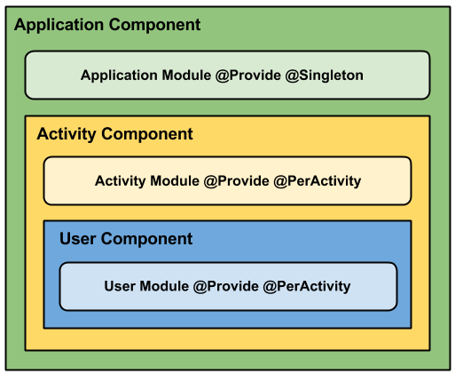
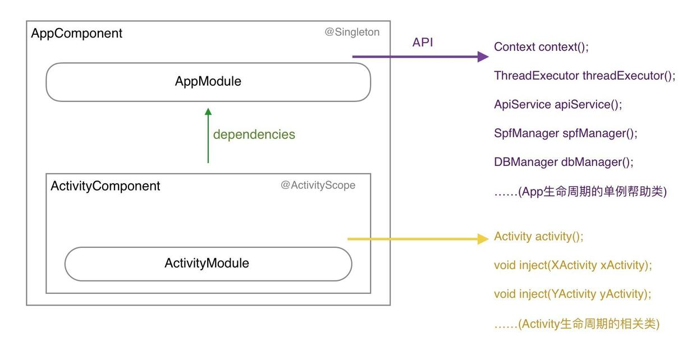
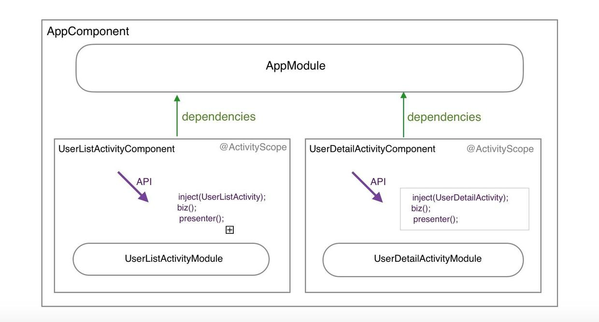

###学习要点：多琢磨官网例子
###一、Dagger2优点：
1. 依赖的注入和配置独立于组件之外，注入的对象在一个独立、不耦合的地方初始化，这样在改变注入对象时，我们只需要修改对象的实现方法，而不用大改代码库。
2. 依赖可以注入到一个组件中：我们可以注入这些依赖的模拟实现，这样使得测试更加简单。
3. app中的组件不需要知道有关实例创建和生命周期的任何事情，这些由我们的依赖注入框架管理的。
4. 依赖的注入和配置独立于组件之外。
5. 因为对象是在一个独立、不耦合的地方初始化，所以当注入抽象方法的时候，我们只需要修改对象的实现方法，而不用大改代码库。
6. 依赖可以注入到一个组件中：我们可以注入这些依赖的模拟实现，这样使得测试更加简单。

####android studio配置
根目录的build.gradle添加路径

	classpath 'com.neenbedankt.gradle.plugins:android-apt:1.4+'	

模块目录的build.gradle中应用插件、添加依赖

	apply plugin: "android-apt"	
	// 或 
	apply plugin: 'com.neenbedankt.android-apt'
	def Dagger2_Version = '2.0.2';
	dependencies {
	    // ....
	    compile "com.google.dagger:dagger:$Dagger2_Version"
	    apt "com.google.dagger:dagger-compiler:$Dagger2_Version"	
		compile 'org.glassfish:javax.annotation:10.0-b28' 
		// Dagger 2 中会用到@Generated注解（后面讲），而javax.anotation.generated在java 6及以上的版本中都有，在Android API 中是没有
	}

###android-apt理解
The android-apt plugin assists in working with annotation processors in combination with Android Studio. It has two purposes:  
1. Allow to configure a compile time only annotation processor as a dependency, not including the artifact in the final APK or library  
2. Set up the source paths so that code that is generated from the annotation processor is correctly picked up by Android Studio.

###Dagger关键注解
1. @Inject：注解构造方法、成员变量
2. @Provides：提供依赖的方法，注解provideXX方法，与@Inject协作完成依赖关系，注意入参与出参不能同一个类
3. @Module：标识类型为module,提供被@Provides、[@Singleton]等注解的provideXX(...)方法
4. @Component：连接提供依赖和消费依赖对象的组件被称为Injector。关联@Inject、@Provider，建议通过它来获取实例。一个Component可以是另一个Component的依赖。
5. @Scope注释

5. @Inject: 通常在需要依赖的地方使用这个注解。换句话说，你用它告诉Dagger这个类或者字段需要依赖注入。这样，Dagger就会构造一个这个类的实例并满足他们的依赖。  
6. @Module: Modules类里面的方法专门提供依赖，所以我们定义一个类，用@Module注解，这样Dagger在构造类的实例的时候，就知道从哪里去找到需要的 依赖。modules的一个重要特征是它们设计为分区并组合在一起（比如说，在我们的app中可以有多个组成在一起的modules）。  
7. @Provide: 在modules中，我们定义的方法是用这个注解，以此来告诉Dagger我们想要构造对象并提供这些依赖。  
8. @Component: Components从根本上来说就是一个注入器，也可以说是@Inject和@Module的桥梁，它的主要作用就是连接这两个部分。 Components可以提供所有定义了的类型的实例，比如：我们必须用@Component注解一个接口然后列出所有的@Modules组成该组件，如 果缺失了任何一块都会在编译的时候报错。所有的组件都可以通过它的modules知道依赖的范围。  
9. @Scope: Scopes可是非常的有用，Dagger2可以通过自定义注解限定注解作用域。后面会演示一个例子，这是一个非常强大的特点，因为就如前面说的一样，没 必要让每个对象都去了解如何管理他们的实例。在scope的例子中，我们用自定义的@PerActivity注解一个类，所以这个对象存活时间就和 activity的一样。简单来说就是我们可以定义所有范围的粒度(@PerFragment, @PerUser, 等等)。  
10. Qualifier: 当类的类型不足以鉴别一个依赖的时候，我们就可以使用这个注解标示。例如：在Android中，我们会需要不同类型的context，所以我们就可以定义 qualifier注解“@ForApplication”和“@ForActivity”，这样当注入一个context的时候，我们就可以告诉 Dagger我们想要哪种类型的context。

###dagger知识
1. Dagger通过@Module中的@Provides方法调用构造函数来获得实例对象。如果你@Inject fields却没有@Inject构造函数，Dagger就会使用一个存在的无参构造函数，若没有@Inject构造函数，就会出错。
2. @Module注解的类，Dagger要求所有的@Provides必须属于一个Module（即@Module注解的类）。  
@Inject实现注入，@Provides实现依赖关系。@Provides方法方法的返回类型就定义了它所满足的依赖。
3. Dagger 1.x中，@Inject和@Provides annotation 构成了对象图谱（graph），依靠之间的依赖关系而链接在一起。通过定义好的图谱集（ObjectGraph）可以方便的调用代码。而在Dagger 2中，这种关系被带有无参方法的接口代替，这种方法返回的类型就是所需类型。这种接口的实现是通过@Component 注解且传入modules参数来定义的。如：

	@Component(  
		// dependencies = ApplicationComponent.class,  
	    modules = ActivityModule.class
		/*假设改module中提供
		Heater provideHeater(ElectricHeater heater) {
			return heater;
		}
		*/   
	)  
	public interface ActivityComponent {  
	    void injectActivity(MainActivity activity);	  
	    ToastHelper getToastHelper();  
	}  

	public class MainActivity extends Activity {
		@Inject Heater heater;
		public void onCreate(Bundle b) {
			super.onCreate(b);
			setContentView(R.layout.main_activity);
			ActivityComponent component = Dagger_ActivityComponent.builder()
			//.applicationComponent(((DaggerApplication) getApplication())
			//.getComponent())  
            //.activityModule(new ActivityModule(this))  
            .build();
			ToastHelper toastHelper =  component.getToastHelper();
			// 或者
			// 完成MainActivity中被@Inject注解的成员变量的实例化，调用
			component.injectActivity(this);
		}
		
	}
在编译时，Dagger 2会自动生成以Dagger_为前缀的此接口的实现Dagger_AcitvityComponent.通过调用此的builder()方法来获得一个实例，通过该方法返回的builder来设置其他依赖，通过build来获得一个新的实例。  	 
如果@Component注解的接口中的方法没有参数，生成的实例中会生成一个create()方法，此create()方法实际上就是
builder().build();
4. Dagger 2 消除了Dagger 1.x 中所有的映射（reflection），通过添加@Component，移除ObjectGraph／Injector使代码更加的清晰。

###图解
1.Application Component: 生命周期跟Application一样的组件。可注入到AndroidApplication和BaseActivity中类中。

----------

	@Singleton // Constraints this component to one-per-application or unscoped bindings.
	@Component(modules = ApplicationModule.class)
	public interface ApplicationComponent {
	  void inject(BaseActivity baseActivity);
	 
	  //Exposed to sub-graphs.
	  Context context();
	  ThreadExecutor threadExecutor();
	  PostExecutionThread postExecutionThread();
	  UserRepository userRepository();
	}
此组件使用@Singleton注解，使其保证唯一性。也许你会问为什么我要将context和其他成员暴露出去。这正是Dagger中 components工作的重要性质：如果你不想把modules的类型暴露出来，那么你就只能显示地使用它们。在这个例子中，我把这些元素暴露给子图， 如果你把他们删掉，编译的时候就会报错。

2.Application Module: module的作用是提供在应用的生命周期中存活的对象。这也是为什么@Provide注解的方法要用@Singleton限定。

	@Module
	public class ApplicationModule {
	  private final AndroidApplication application;
	 
	  public ApplicationModule(AndroidApplication application) {
	    this.application = application;
	  }
	 
	  @Provides @Singleton Context provideApplicationContext() {
	    return this.application;
	  }
	 
	  @Provides @Singleton Navigator provideNavigator() {
	    return new Navigator();
	  }
	 
	  @Provides @Singleton ThreadExecutor provideThreadExecutor(JobExecutor jobExecutor) {
	    return jobExecutor;
	  }
	 
	  @Provides @Singleton PostExecutionThread providePostExecutionThread(UIThread uiThread) {
	    return uiThread;
	  }
	 
	  @Provides @Singleton UserCache provideUserCache(UserCacheImpl userCache) {
	    return userCache;
	  }
	 
	  @Provides @Singleton UserRepository provideUserRepository(UserDataRepository userDataRepository) {
	    return userDataRepository;
	  }
	}

3.Activity Component: 生命周期跟Activity一样的组件。

	@PerActivity
	@Component(dependencies = ApplicationComponent.class, modules = ActivityModule.class)
	public interface ActivityComponent {	  
	  Activity activity();//Exposed to sub-graphs.
	}
@PerActivity是一个自定义的范围注解，作用是允许对象被记录在正确的组件中，当然这些对象的生命周期应该遵循activity的生命周期。

注入对象到构造方法需要的activity。在一个per-activity基础上的单例使用。只能在activity中使用使得全局的对象图保持清晰。

	@Scope
	@Retention(RUNTIME)
	public @interface PerActivity {}

4.Activity Module: 在对象图中，这个module把activity暴露给相关联的类。比如在fragment中使用activity的context。
	
	@Module
	public class ActivityModule {
	  private final Activity activity;
	 
	  public ActivityModule(Activity activity) {
	    this.activity = activity;
	  }
	 
	  @Provides @PerActivity Activity activity() {
	    return this.activity;
	  }
	}

5.User Component: 继承于ActivityComponent的组件，并用@PerActivity注解。我通常会在注入用户相关的fragment中使用。因为 ActivityModule把activity暴露给图了，所以在任何需要一个activity的context的时候，Dagger都可以提供注入， 没必要再在子modules中定义了。
	
	@PerActivity
	@Component(dependencies = ApplicationComponent.class, modules = {ActivityModule.class, UserModule.class})
	public interface UserComponent extends ActivityComponent {
	  void inject(UserListFragment userListFragment);
	  void inject(UserDetailsFragment userDetailsFragment);
	}

6.User Module: 提供跟用户相关的实例。
	
	@Module
	public class UserModule {
	  @Provides @PerActivity GetUserListUseCase provideGetUserListUseCase(GetUserListUseCaseImpl getUserListUseCase) {
	    return getUserListUseCase;
	  }
	 
	  @Provides @PerActivity GetUserDetailsUseCase provideGetUserDetailsUseCase(GetUserDetailsUseCaseImpl getUserDetailsUseCase) {
	    return getUserDetailsUseCase;
	  }
	}
7.整合  
a. 构造方法注入：在类的构造方法前面注释@Inject  
b. 成员变量注入：在类的成员变量（非私有）前面注释@Inject  
c. 函数方法注入：在函数前面注释@Inject  

	public abstract class BaseActivity extends Activity {
	 
	  @Inject Navigator navigator; // 成员变量注入
	 
	  @Override
	  protected void onCreate(Bundle savedInstanceState) {
	    super.onCreate(savedInstanceState);
	    this.getApplicationComponent().inject(this); // 注入后才能使用
	  }
	 
	  protected ApplicationComponent getApplicationComponent() {
	    return ((AndroidApplication)getApplication()).getApplicationComponent();
	  }
	 
	  protected ActivityModule getActivityModule() {
	    return new ActivityModule(this);
	  }
	}
Navigator类是成员变量注入的，由ApplicationModule里面@Provide注解显示提供的。最终我们初始化 component然后调用inject()方法注入成员变量。

在Fragment的presenter中我们也做了同样的事情，使用@PerActivity范围限定的component，注入到UserDetailsFragment中的UserComponent其实是驻留在 UserDetailsActivity中的。

	private UserComponent userComponent;
必须在activity的onCreate()方法中用下面的方式初始化。

	private void initializeInjector() {
	  this.userComponent = DaggerUserComponent.builder()
	      .applicationComponent(getApplicationComponent())
	      .activityModule(getActivityModule())
	      .build();
	}
Dagger会处理我们的注解，为components生成实现并重命名加上“Dagger”前缀。因为这个是一个组合的component，所以在构建 的时候，我们必须把所有的依赖的传进去（components和modules）。

	@Override public UserComponent getComponent() {
	  return userComponent;
	}
利用get方法获取创建的component，然后调用inject()方法将Fragment作为参数传进去，完成绑定UserDetailsFragment依赖。

	@Override public void onActivityCreated(Bundle savedInstanceState) {
	  super.onActivityCreated(savedInstanceState);
	  this.getComponent().inject(this);
	}

###二、MVP
1. 传统MVP: M层处理业务逻辑，P层仅仅是V和M的桥梁。
2. 另类MVP：P层同时处理与model相关的业务逻辑，不处理View层次的逻辑，View层次的逻辑交给V自己处理，M层仅仅是bean。

###三、dagger结构图
####mvp结构图  

####1. AppComponent: 
生命周期跟Application一样的组件。可注入到自定义的Application类中，@Singletion代表各个注入对象为单例。

	@Singleton
	@Component(modules = AppModule.class)
	public interface AppComponent {
	    Context context();  // 提供Applicaiton的Context	
	    ThreadExecutor threadExecutor();   // 线程池	
	    ApiService apiService();  // 所有Api请求的管理类	
	    SpfManager spfManager();  // SharedPreference管理类	
	    DBManager dbManager();  // 数据库管理类
	}
####2. AppModule: 
这里提供了AppComponent里的需要注入的对象。

	@Module
	public class AppModule {
	    private final MyApplication application;	
	    public AppModule(MyApplication application) {
	        this.application = application;
	    }
	
	    @Provides
	    @Singleton
	    Context provideApplicationContext() { 
	       return application;
	    }
	
	    @Provides
	    @Singleton
	    ThreadExecutor provideThreadExecutor(JobExecutor jobExecutor) {
	        return jobExecutor;
	    }
	
	    @Provides
	    @Singleton
	    ApiService providesApiService(RetrofitManager retrofitManager) {
	        return retrofitManager.getService();
	    }
	
	    @Provides
	    @Singleton
	    SpfManager provideSpfManager() {
	        return new SpfManager(application);
	    }
	
	    @Provides
	    @Singleton
	    DBManager provideDBManager() {
	        return new DBManager(application);
	    }
		/*
		@Provides
	    @Singleton
		DBManager provideDBManager(DBManager dbManager) {
		  return dbManager;
		}
		*/
		// 入参和出参类型相同，编译会报一个循环依赖的错误，因此直接返回参数时需要不是同一个类。
	}
	

	// 直接返回的类JobExecutor、RetrofitManager，它们类的构造函数一定要加上@Inject的注解：
	class JobExecutor {
		@Inject
		public JobExecutor() {
		    // 初始化
		    // ......
		}
		// ...
	}

####3. ActivityComponent
@ActivityScope注解是自定义的，对应Activity的生命周期，Dagger2可以通过自定义注解限定注解作用域，一般在Module里规定scope的生命周期，比如下面的ActivityScope在ActivityModule里绑定。

ActivityComponent：生命周期跟Activity一样的组件，这里提供了inject方法将Activity注入到ActivityComponent中，通过该方法，将Activity中需要注入的对象注入到该Activity中。
	@Scope
	@Retention(RUNTIME)
	public @interface ActivityScope {
	}
	
	
	@ActivityScope
	@Component(dependencies = AppComponent.class, modules = ActivityModule.class)
	public interface ActivityComponent {
	    Activity activity();	
	    void inject(LoginActivity loginActivity);	
	    void inject(MainActivity mainActivity);	
	    // ....
	}

####4. ActivityModule
注入Activity，同时规定Activity所对应的域是@ActivityScope

	@Module
	public class ActivityModule {
	    private final Activity activity;
	
	    public ActivityModule(Activity activity) {
	        this.activity = activity;
	    }
	
	    @Provides
	    @ActivityScope
	    Activity activity() {
	        return this.activity;
	    }
	}

####5. dagger推荐结构图

对于不同的Activity，创建各个对应的ActivityCompontent，同时把Presenter(Biz)注入到Component的视图中，这也是dagger2推荐的做法，Dagger 2希望使用@Component注解接口将依赖关系链接起来。

####6.注入
此处没有把Presenter注入到ActivityComponent中，因为Presenter的作用域和Activity一样，好处是节省代码（－ －），大家可以自行选择注入方式。

	public class LoginActivity extends BaseActivity implements LoginView, ValidCodeView {
	    @Inject LoginPresenter loginPresenter;	
	    @Inject ValidCodePresenter validCodePresenter;
	
	   @Override
	    protected void onCreate(Bundle savedInstanceState) {
	        super.onCreate(savedInstanceState);
	        setContentView(R.layout.activity_login);
	
	        initInject();
	        // 此处省略N行代码
	    }
	
	    private void initInject() {
	        // 构建Component并注入
	        getActivityComponent().inject(this);
	        loginPresenter.attachView(this);
	        validCodePresenter.attachView(this);
	    }
	
	    //  建议写在基类Activity里
	    protect ActivityComponent getActivityComponent(){
	          return  DaggerActivityComponent.builder()
	                      .appComponent(getAppComponent())
	                      .activityModule(getActivityModule())
	                      .build();
	    }
	
	    //  建议写在基类Activity里
	    protect ActivityModule getActivityModule(){
	          return new ActivityModule(this);
	    }
	
	    // 建议写在MyApplication类里
	    public AppComponent getAppComponent(){
	         return DaggerAppComponent.builder()
	         .appModule(new AppModule((MyApplication)getApplicationContext()))
	         .build();
	    }
	}

	@ActivityScope
	public class LoginPresenter extends DefaultMvpPresenter<LoginView, RESTResult<UserVO>> {
	     // 此处省略
	
	    @Inject
	    public LoginPresenter(ApiService apiService, ThreadExecutor jobExecutor, SpfManager spfManager) {
	        this.apiService = apiService;
	        this.jobExecutor = jobExecutor;
	        this.spfManager = spfManager;
	    }
	    public void login(String mobile, String code) {
	          // todo
	    }
	}

###参考
1. [Dagger 2 官网及例子](https://github.com/google/dagger)
2. [Android 依赖注入： Dagger 2 实例讲解（一）](http://blog.csdn.net/zjbpku/article/details/42109891)
3. [详解dagger 2](http://www.jcodecraeer.com/a/anzhuokaifa/androidkaifa/2015/0519/2892.html)
4. [dagger2 使用](http://www.jianshu.com/p/c2feb21064bb)
5. [使用Dagger 2进行依赖注入](http://codethink.me/2015/08/06/dependency-injection-with-dagger-2/?utm_source=tuicool&utm_medium=referral)