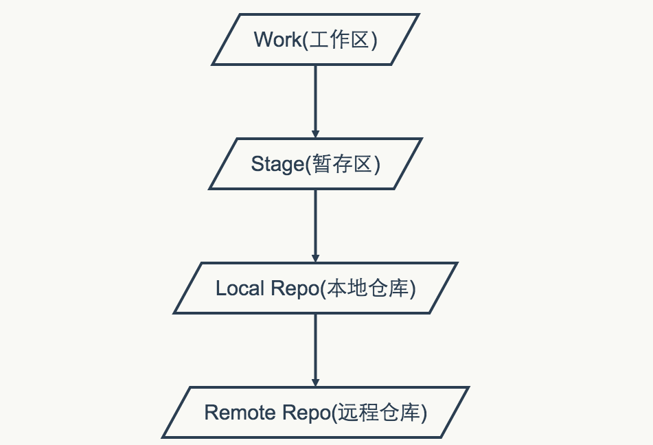
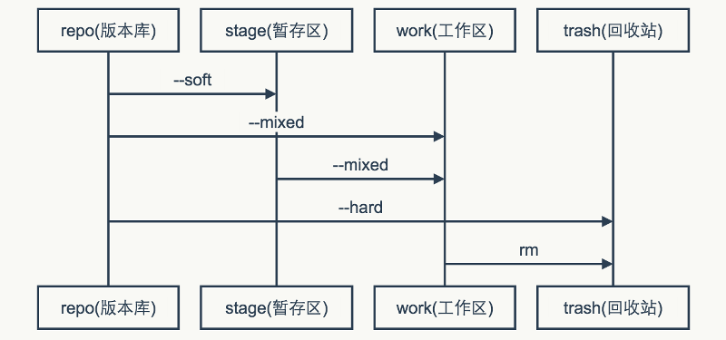

###图
 

	

	# 继续上步冲突的合并操作，即可rebase成功  
	git rebase --continue  
	# 如果想放弃这次合并，--continue换成--abort  
	git rebase --abort  
	# 如果冲突了不管，--continue换成--skip  
	git rebase --skip  
	# 把本地仓库的提交推送到远程仓库  
	git push origin master  
	# 拉取代码，但不合并  
	git fetch origin master  
	# 合并本地代码和最新拉取的代码  
	git rebase origin/master  
	# 添加tag
	git tag -a 1.0.3 -m 'publish a version 1.0.3'
	# 显示tag
	git show 1.0.3
	# 合并标签到远程版本库
	# 推送某个标签到远程版本库
	git push origin 1.0.3
	# 推送所有标签到远程版本库
	git push origin --tags
	# 检出标签
	git checkout -b myTagBranch 1.0.3
	# 基于当前分支创建dev分支
	git checkout -b dev
	# 推送本地dev分支到远程分支
	git push origin dev:dev
	# 删除dev分支
	git branch -D dev
	# 回到到324214130的tree index，默认参数--mixed, 保留源码，代码状态回退到工作区
	git reset 3242a4130142478023231225551a9b7dcb4441e3
	# 回退324214130的commit，相当于把这个commit的改动再反向操作了一次
	git revert 3242a4130142478023231225551a9b7dcb4441e3
	# 自定义你喜欢的编辑器，可选
	git config --global core.editor vim
	# 自定义差异工具，可选
	git config --global merge.tool vimdiff
	git config --global mergetool.prompt false
	# 为git着色
	git config --global color.ui true
	# 修改上次的提交
	git commit --amend
	# 合并本地所有未提交的提交, 在弹出的交互界面， 保留一行的pick，把其他每行提交的pick改为fixup或者squuash
	# 其实从上面的操作上看，如果你想保留几个提交，就保留几个pick即可
	git rebase -i origin/master
	# 合并最后两个提交, 在弹出的交互界面，操作同上
	git rebase -i HEAD~2
	// 切换到分支B
	git checkout B
	// 把之前的commit使用cherry-pick命令到当前分支
	git cherry-pick 5d1c8562cd3d6b902e7d1542940ba39a97179017
##一、git常用命令
1. git init  
     初始化一个repo,并在当前文件夹下创建一个.git文件夹.
 
2. git clone  
     获取一个url对应的远程Git repo, 创建一个local copy.  
     一般的格式是git clone [url].  
     clone下来的repo会以url最后一个斜线后面的名称命名,创建一个文件夹,如果想要指定特定的名称,可以git clone [url] newname指定.
 
3. git status  
     查询repo的状态.
     git status -s: -s表示short, -s的输出标记会有两列,第一列是对staging区域而言,第二列是对working目录而言.
 
4. git log  
     show commit history of a branch.  
     git log --oneline --number: 每条log只显示一行,显示number条.  
     git log --oneline --graph:可以图形化地表示出分支合并历史.  
     git log branchname可以显示特定分支的log.  
     git log --oneline branch1 ^branch2,可以查看在分支1,却不在分支2中的提交.^表示排除这个分支(Window下可能要给^branch2加上引号).  
     git log --decorate会显示出tag信息.  
     git log --author=[author name] 可以指定作者的提交历史.  
     git log --since --before --until --after 根据提交时间筛选log.    
     --no-merges可以将merge的commits排除在外.  
     git log --grep 根据commit信息过滤log: git log --grep=keywords  
     默认情况下, git log --grep --author是OR的关系,即满足一条即被返回,如果你想让它们是AND的关系,可以加上--all-match的option.  
     git log -S: filter by introduced diff.  
     比如: git log -SmethodName (注意S和后面的词之间没有等号分隔).  
     git log -p: show patch introduced at each commit.  
     每一个提交都是一个快照(snapshot),Git会把每次提交的diff计算出来,作为一个patch显示给你看.  
     另一种方法是git show [SHA].  
     git log --stat: show diffstat of changes introduced at each commit.  
     同样是用来看改动的相对信息的,--stat比-p的输出更简单一些.  
    
5. git add  
     在提交之前,Git有一个暂存区(staging area),可以放入新添加的文件或者加入新的改动. commit时提交的改动是上一次加入到staging area中的改动,而不是我们disk上的改动.  
     [git add .]会递归地添加当前工作目录中的所有文件.
 
6. git diff  
     不加参数的git diff:  
     show diff of unstaged changes.  
     此命令比较的是工作目录中当前文件和暂存区域快照之间的差异,也就是修改之后还没有暂存起来的变化内容.  
 
     若要看已经暂存起来的文件和上次提交时的快照之间的差异,可以用:  
     git diff --cached 命令.  
     show diff of staged changes.  
     (Git 1.6.1 及更高版本还允许使用 git diff --staged，效果是相同的).  
 
     git diff HEAD  
     show diff of all staged or unstated changes.  
     也即比较woking directory和上次提交之间所有的改动.  
 
     如果想看自从某个版本之后都改动了什么,可以用:  
     git diff [version tag]  
     跟log命令一样,diff也可以加上--stat参数来简化输出.  
 
     git diff [branchA] [branchB]可以用来比较两个分支.  
     它实际上会返回一个由A到B的patch,不是我们想要的结果.  
     一般我们想要的结果是两个分支分开以后各自的改动都是什么,是由命令:  
     git diff [branchA]…[branchB]给出的.  
     实际上它是:git diff $(git merge-base [branchA] [branchB]) [branchB]的结果.  
 
 
7. git commit  
     提交已经被add进来的改动.  
     git commit -m “the commit message"  
     git commit -a 会先把所有已经track的文件的改动add进来,然后提交(有点像svn的一次提交,不用先暂存). 对于没有track的文件,还是需要git add一下.  
     git commit --amend 增补提交. 会使用与当前提交节点相同的父节点进行一次新的提交,旧的提交将会被取消.  
 
8. git reset  
     undo changes and commits.  
     这里的HEAD关键字指的是当前分支最末梢最新的一个提交.也就是版本库中该分支上的最新版本.  
     git reset HEAD: unstage files from index and reset pointer to HEAD  
     这个命令用来把不小心add进去的文件从staged状态取出来,可以单独针对某一个文件操作:   
	 git reset HEAD --filename, 这个-- 也可以不加.  
     git reset --soft  
     move HEAD to specific commit reference, index and staging are untouched.  
     git reset --hard  
     unstage files AND undo any changes in the working directory since last commit.  
     使用git reset —hard HEAD进行reset,即上次提交之后,所有staged的改动和工作目录的改动都会消失,还原到上次提交的状态.  
     这里的HEAD可以被写成任何一次提交的SHA-1.  
     不带soft和hard参数的git reset,实际上带的是默认参数mixed.  
 
     总结:  
     git reset --mixed id,是将git的HEAD变了(也就是提交记录变了),但文件并没有改变，(也就是working tree并没有改变). 取消了commit和add的内容.    
     git reset --soft id. 实际上，是git reset –mixed id 后,又做了一次git add.即取消了commit的内容.  
     git reset --hard id.是将git的HEAD变了,文件也变了.  
     按改动范围排序如下:  
     soft (commit) < mixed (commit + add) < hard (commit + add + local working)  
 
9. git revert
     反转撤销提交.只要把出错的提交(commit)的名字(reference)作为参数传给命令就可以了.  
     git revert HEAD: 撤销最近的一个提交.  
     git revert会创建一个反向的新提交,可以通过参数-n来告诉Git先不要提交.  
    
10. git rm  
     git rm file: 从staging区移除文件,同时也移除出工作目录.  
     git rm --cached: 从staging区移除文件,但留在工作目录中.  
     git rm --cached从功能上等同于git reset HEAD,清除了缓存区,但不动工作目录树.  
 
11. git clean  
     git clean是从工作目录中移除没有track的文件.  
     通常的参数是git clean -df:  
     -d表示同时移除目录,-f表示force,因为在git的配置文件中, clean.requireForce=true,如果不加-f,clean将会拒绝执行.  
 
12. git mv  
     git rm --cached orig; mv orig new; git add new
 
13. git stash  
     把当前的改动压入一个栈.  
     git stash将会把当前目录和index中的所有改动(但不包括未track的文件)压入一个栈,然后留给你一个clean的工作状态,即处于上一次最新提交处.  
     git stash list会显示这个栈的list.  
     git stash apply:取出stash中的上一个项目(stash@{0}),并且应用于当前的工作目录.    
     也可以指定别的项目,比如git stash apply stash@{1}.    
     如果你在应用stash中项目的同时想要删除它,可以用git stash pop    
 
     删除stash中的项目:  
     git stash drop: 删除上一个,也可指定参数删除指定的一个项目.  
     git stash clear: 删除所有项目.  
 
14. git branch
     git branch可以用来列出分支,创建分支和删除分支.  
     git branch -v可以看见每一个分支的最后一次提交.  
     git branch: 列出本地所有分支,当前分支会被星号标示出.  
     git branch (branchname): 创建一个新的分支(当你用这种方式创建分支的时候,分支是基于你的上一次提交建立的).   
     git branch -d (branchname): 删除一个分支.  
     删除remote的分支:
     git push (remote-name) :(branch-name): delete a remote branch.  
     这个是因为完整的命令形式是:
     git push remote-name local-branch:remote-branch  
     而这里local-branch的部分为空,就意味着删除了remote-branch  
 
15. git checkout  
　　git checkout (branchname)   切换到一个分支.  
     git checkout -b (branchname): 创建并切换到新的分支.  
     这个命令是将git branch newbranch和git checkout newbranch合在一起的结果.  
     checkout还有另一个作用:替换本地改动:  
     git checkout --<filename>  
     此命令会使用HEAD中的最新内容替换掉你的工作目录中的文件.已添加到暂存区的改动以及新文件都不会受到影响.
     注意:git checkout filename会删除该文件中所有没有暂存和提交的改动,这个操作是不可逆的.  
 
16. git merge  
     把一个分支merge进当前的分支.  
     git merge [alias]/[branch]  
     把远程分支merge到当前分支.  
 
     如果出现冲突,需要手动修改,可以用git mergetool.  
     解决冲突的时候可以用到git diff,解决完之后用git add添加,即表示冲突已经被resolved.  
 
17. git tag  
     tag a point in history as import.  
     会在一个提交上建立永久性的书签,通常是发布一个release版本或者ship了什么东西之后加tag.  
     比如: git tag v1.0   
     git tag -a v1.0, -a参数会允许你添加一些信息,即make an annotated tag.  
     当你运行git tag -a命令的时候,Git会打开一个编辑器让你输入tag信息.  
     
     我们可以利用commit SHA来给一个过去的提交打tag:  
     git tag -a v0.9 XXXX  
 
     push的时候是不包含tag的,如果想包含,可以在push时加上--tags参数.  
     fetch的时候,branch HEAD可以reach的tags是自动被fetch下来的, tags that aren’t reachable from branch heads will be skipped.如果想确保所有的tags都被包含进来,需要加上--tags选项.  
 
18. git remote  
     list, add and delete remote repository aliases.
     因为不需要每次都用完整的url,所以Git为每一个remote repo的url都建立一个别名,然后用git remote来管理这个list.  
     git remote: 列出remote aliases.  
     如果你clone一个project,Git会自动将原来的url添加进来,别名就叫做:origin.  
     git remote -v:可以看见每一个别名对应的实际url.  
     git remote add [alias] [url]: 添加一个新的remote repo.  
     git remote rm [alias]: 删除一个存在的remote alias.  
     git remote rename [old-alias] [new-alias]: 重命名.  
     git remote set-url [alias] [url]:更新url. 可以加上—push和fetch参数,为同一个别名set不同的存取地址.  
 
19. git fetch  
     download new branches and data from a remote repository.  
     可以git fetch [alias]取某一个远程repo,也可以git fetch --all取到全部repo  
     fetch将会取到所有你本地没有的数据,所有取下来的分支可以被叫做remote branches,它们和本地分支一样(可以看diff,log等,也可以merge到其他分支),但是Git不允许你checkout到它们.   
 
20. git pull  
     fetch from a remote repo and try to merge into the current branch.  
     pull == fetch + merge FETCH_HEAD  
     git pull会首先执行git fetch,然后执行git merge,把取来的分支的head merge到当前分支.这个merge操作会产生一个新的commit.      
     如果使用--rebase参数,它会执行git rebase来取代原来的git merge.  
  
 
21. git rebase  
     --rebase不会产生合并的提交,它会将本地的所有提交临时保存为补丁(patch),放在”.git/rebase”目录中,然后将当前分支更新到最新的分支尖端,最后把保存的补丁应用到分支上.
     rebase的过程中,也许会出现冲突,Git会停止rebase并让你解决冲突,在解决完冲突之后,用git add去更新这些内容,然后无需执行commit,只需要:  
     git rebase --continue就会继续打余下的补丁.  
     git rebase --abort将会终止rebase,当前分支将会回到rebase之前的状态.  
 
22. git push  
     push your new branches and data to a remote repository.  
     git push [alias] [branch]  
     将会把当前分支merge到alias上的[branch]分支.如果分支已经存在,将会更新,如果不存在,将会添加这个分支.
     如果有多个人向同一个remote repo push代码, Git会首先在你试图push的分支上运行git log,检查它的历史中是否能看到server上的branch现在的tip,如果本地历史中不能看到server的tip,说明本地的代码不是最新的,Git会拒绝你的push,让你先fetch,merge,之后再push,这样就保证了所有人的改动都会被考虑进来.
 
23. git reflog  
     git reflog是对reflog进行管理的命令,reflog是git用来记录引用变化的一种机制,比如记录分支的变化或者是HEAD引用的变化.  
     当git reflog不指定引用的时候,默认列出HEAD的reflog.  
     HEAD@{0}代表HEAD当前的值,HEAD@{3}代表HEAD在3次变化之前的值.  
     git会将变化记录到HEAD对应的reflog文件中,其路径为.git/logs/HEAD, 分支的reflog文件都放在.git/logs/refs目录下的子目录中.  
 
 
24. 特殊符号:  
     ^代表父提交,当一个提交有多个父提交时,可以通过在^后面跟上一个数字,表示第几个父提交: ^相当于^1.  
     ~<n>相当于连续的<n>个^.  

##二、.gitignore文件的格式规范：
1. 所有空行或者以注释符号 ＃ 开头的行都会被 Git 忽略。
2. 可以使用标准的 glob 模式匹配。
3. 匹配模式最后跟反斜杠（/）说明要忽略的是目录。
4. 要忽略指定模式以外的文件或目录，可以在模式前加上惊叹号（!）取反。

例子：
----------
	# 此为注释 – 将被 Git 忽略 
	*.a # 忽略所有 .a 结尾的文件   
	!lib.a # 但 lib.a 除外   
	/TODO # 仅仅忽略项目根目录下的 TODO 文件，不包括 subdir/TODO   
	build/ # 忽略 build/ 目录下的所有文件   
	doc/*.txt # 会忽略   
	doc/notes.txt 但不包括 doc/server/arch.txt  