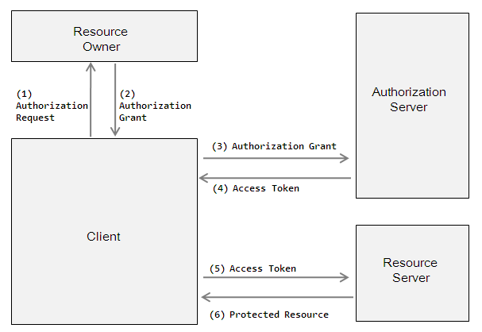
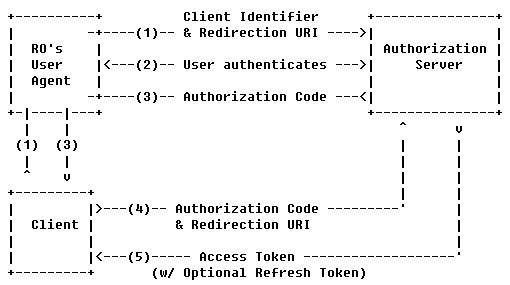
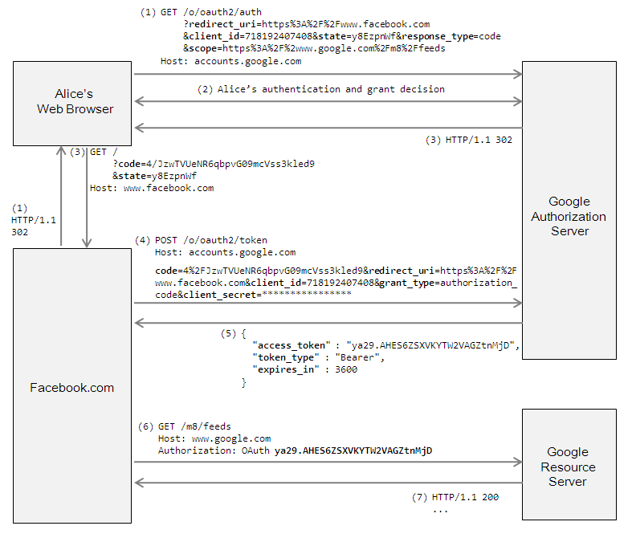

###OAuth协议
###一、基本思路

(1) Client请求Resource Owner的授权，请求中一般包含：要访问的资源路径，操作类型，Client的身份等信息。  
(2) RO批准授权，并将“授权证据”发送给Client。RO批准典型做法: AS提供授权审批界面，让RO显式批准。  
(3) Client向AS请求“访问令牌(Access Token)”。此时，Client需向AS提供RO的“授权证据”，以及Client自己身份的凭证。  
(4) AS验证通过后，向Client返回“访问令牌”。访问令牌也有多种类型，若为bearer类型，那么谁持有访问令牌，谁就能访问资源。  
(5) Client携带“访问令牌”访问RS上的资源。在令牌的有效期内，Client可以多次携带令牌去访问资源。  
(6) RS验证令牌的有效性，比如是否伪造、是否越权、是否过期，验证通过后，才能提供服务。  

###二、 授权码类型的开放授权

1) Client初始化协议的执行流程。首先通过HTTP 302来重定向RO用户代理到AS。Client在redirect_uri中应包含如下参数：client_id, scope (描述被访问的资源), redirect_uri (即Client的URI), state (用于抵制CSRF攻击). 此外，请求中还可以包含access_type和approval_prompt参数。当approval_prompt=force时，AS将提供交互页面，要求RO必须显式地批准（或拒绝）Client的此次请求。如果没有approval_prompt参数，则默认为RO批准此次请求。当access_type=offline时，AS将在颁发access_token时，同时还会颁发一个refresh_token。因为access_token的有效期较短（如3600秒），为了优化协议执行流程，offline方式将允许Client直接持refresh_token来换取一个新的access_token。  

(2) AS认证RO身份，并提供页面供RO决定是否批准或拒绝Client的此次请求（当approval_prompt=force时）。  
(3) 若请求被批准，AS使用步骤(1)中Client提供的redirect_uri重定向RO用户代理到Client。redirect_uri须包含authorization_code，以及步骤1中Client提供的state。若请求被拒绝，AS将通过redirect_uri返回相应的错误信息。  
(4) Client拿authorization_code去访问AS以交换所需的access_token。Client请求信息中应包含用于认证Client身份所需的认证数据，以及上一步请求authorization_code时所用的redirect_uri。  

(5) AS在收到authorization_code时需要验证Client的身份，并验证收到的redirect_uri与第3步请求authorization_code时所使用的redirect_uri相匹配。如果验证通过，AS将返回access_token，以及refresh_token（若access_type=offline）。  

###三、实例

###四、java授权开源库
1. 注意1.0.1有个multidex 重复问题。
compile('org.apache.oltu.oauth2:org.apache.oltu.oauth2.client:1.0.0') {
	    exclude group: 'org.json', module: 'json'
	  }

2. 源码	
	public class Oauth2Util {
	    public static final String SITE_URL = "https://trakt.tv";
	    public static final String API_URL = "https://api-v2launch.trakt.tv";
	    public static final String HEADER_TRAKT_API_VERSION_2 = "2";
	    public static final String HEADER_CONTENT_TYPE_JSON = "application/json";
	
	    public static final String OAUTH2_AUTHORIZATION_URL = SITE_URL + "/oauth/authorize";
	    public static final String OAUTH2_TOKEN_URL = SITE_URL + "/oauth/token";
	
	    /**
	     * Build an OAuth 2.0 authorization request to obtain an authorization code.
	     *
	     * 
Send the user to the location URI of this request. Once the user authorized your app, the server will redirect
	     * to {@code redirectUri} with the authorization code and the sent state in the query parameter {@code code}.
	     *
	     * 
Ensure the state matches, then supply the authorization code to {@link #getAccessToken} to get an access
	     * token.
	     *
	     * @param clientId The OAuth client id obtained from trakt.
	     * @param redirectUri The URI as configured on trakt to redirect to with appended auth code and state query
	     * parameters.
	     * @param state State variable to prevent request forgery attacks.
	     * @param username Pre-fill the username field.
	     */
	    public static OAuthClientRequest getAuthorizationRequest(String clientId, String redirectUri, String state,
	        String username) throws OAuthSystemException {
	        OAuthClientRequest.AuthenticationRequestBuilder builder = OAuthClientRequest
	            .authorizationLocation(OAUTH2_AUTHORIZATION_URL)
	            .setResponseType(ResponseType.CODE.toString())
	            .setClientId(clientId)
	            .setRedirectURI(redirectUri)
	            .setState(state);
	        if (username != null && username.length() != 0) {
	            builder.setParameter("username", username);
	        }
	        return builder.buildQueryMessage();
	    }
	
	    /**
	     * Build an OAuth 2.0 access token request. The grant is based on an authorization code that was just obtained from
	     * an authorization request.
	     *
	     * @param clientId The OAuth client id obtained from trakt.
	     * @param clientSecret The OAuth client secret obtained from trakt.
	     * @param redirectUri The redirect URI as configured on trakt.
	     * @param authCode A just obtained authorization code.
	     */
	    public static OAuthClientRequest getAccessTokenRequest(String clientId, String clientSecret, String redirectUri,
	        String authCode) throws OAuthSystemException {
	        return OAuthClientRequest
	            .tokenLocation(OAUTH2_TOKEN_URL)
	            .setGrantType(GrantType.AUTHORIZATION_CODE)
	            .setCode(authCode)
	            .setRedirectURI(redirectUri)
	            .setClientId(clientId)
	            .setClientSecret(clientSecret)
	            .buildBodyMessage();
	            //.buildQueryMessage();
	    }
	
	    /**
	     * Request an access token from trakt. Builds the request with {@link #getAccessTokenRequest} and executes it, then
	     * returns the response which includes the access token.
	     *
	     * 
Supply the received access token to {@link #setAccessToken(String)} and store the refresh token to later
	     * refresh the access token once it has expired.
	     *
	     * 
On failure re-authorization of your app is required (see {@link #getAuthorizationRequest}).
	     *
	     * @param clientId The OAuth client id obtained from trakt.
	     * @param clientSecret The OAuth client secret obtained from trakt.
	     * @param redirectUri The redirect URI as configured on trakt.
	     * @param authCode A valid authorization code (see {@link #getAuthorizationRequest(String, String, String,
	     * String)}).
	     */
	    public static OAuthAccessTokenResponse getAccessToken(String clientId, String clientSecret, String redirectUri,
	        String authCode) throws OAuthSystemException, OAuthProblemException {
	        OAuthClientRequest request = getAccessTokenRequest(clientId, clientSecret, redirectUri, authCode);
	        OAuthClient client = new OAuthClient(new TraktHttpClient());
	        return client.accessToken(request);
	    }
	
	    /**
	     * Build an OAuth 2.0 access token request. The grant is based on the refresh token obtained with the last access
	     * token request response.
	     *
	     * @param clientId The OAuth client id obtained from trakt.
	     * @param clientSecret The OAuth client secret obtained from trakt.
	     * @param redirectUri The redirect URI as configured on trakt.
	     * @param refreshToken The refresh token obtained with the last access token request response.
	     * 谨记非UI线程调用
	     */
	    public static OAuthClientRequest getAccessTokenRefreshRequest(String clientId, String clientSecret,
	        String redirectUri, String refreshToken) throws OAuthSystemException {
	        return OAuthClientRequest
	            .tokenLocation(OAUTH2_TOKEN_URL)
	            .setGrantType(GrantType.REFRESH_TOKEN)
	            .setRefreshToken(refreshToken)
	            .setRedirectURI(redirectUri)
	            .setClientId(clientId)
	            .setClientSecret(clientSecret)
	            .buildQueryMessage();
	    }
	
	    /**
	     * Request to refresh an expired access token for trakt. If your app is still authorized, returns a response which
	     * includes a new access token.
	     *
	     * 
Supply the received access token to {@link #setAccessToken(String)} and store the refresh token to later
	     * refresh the access token once it has expired.
	     *
	     * 
On failure re-authorization of your app is required (see {@link #getAuthorizationRequest}).
	     *
	     * @param clientId The OAuth client id obtained from trakt.
	     * @param clientSecret The OAuth client secret obtained from trakt.
	     * @param redirectUri The redirect URI as configured on trakt.
	     * @param refreshToken The refresh token obtained with the last access token request response.
	     * 谨记非UI线程调用
	     */
	    public static OAuthAccessTokenResponse refreshAccessToken(String clientId, String clientSecret, String redirectUri,
	        String refreshToken) throws OAuthSystemException, OAuthProblemException {
	        OAuthClientRequest request = getAccessTokenRefreshRequest(clientId, clientSecret, redirectUri, refreshToken);
	
	        OAuthClient client = new OAuthClient(new TraktHttpClient());
	        return client.accessToken(request);
	    }
	}

----------

	import java.io.IOException;
	import java.util.Map;
	import java.util.concurrent.TimeUnit;
	import me.utils.KLog;
	import okhttp3.MediaType;
	import okhttp3.OkHttpClient;
	import okhttp3.Request;
	import okhttp3.RequestBody;
	import okhttp3.Response;
	import org.apache.oltu.oauth2.client.HttpClient;
	import org.apache.oltu.oauth2.client.request.OAuthClientRequest;
	import org.apache.oltu.oauth2.client.response.OAuthClientResponse;
	import org.apache.oltu.oauth2.client.response.OAuthClientResponseFactory;
	import org.apache.oltu.oauth2.common.exception.OAuthProblemException;
	import org.apache.oltu.oauth2.common.exception.OAuthSystemException;
	import org.apache.oltu.oauth2.common.utils.OAuthUtils;
	
	public class TraktHttpClient implements HttpClient {
	
	    @Override
	    public <T extends OAuthClientResponse> T execute(OAuthClientRequest request, Map<String, String> headers,
	            String requestMethod, Class<T> responseClass) throws OAuthSystemException,
	        OAuthProblemException {
	        OkHttpClient client = new OkHttpClient.Builder()
	            .connectTimeout(60, TimeUnit.SECONDS)
	            .readTimeout(60, TimeUnit.SECONDS)
	            .writeTimeout(60, TimeUnit.SECONDS)
	            .build();
	
	        try {
	            final Request.Builder rb = new Request.Builder();
	            if (headers != null && !headers.isEmpty()) {
	                for (Map.Entry<String, String> header : headers.entrySet()) {
	                    rb.addHeader(header.getKey(), header.getValue());
	                }
	            }
	            if (request.getHeaders() != null) {
	                for (Map.Entry<String, String> header : request.getHeaders().entrySet()) {
	                    rb.addHeader(header.getKey(), header.getValue());
	                }
	            }
	
	            if (!OAuthUtils.isEmpty(requestMethod)) {
	                //connection.setRequestMethod(requestMethod);
	                if (requestMethod.equals("POST")) {
	                    String type = request.getHeader("Content-Type");
	                    if( type == null ) {
	                        type = headers.get("Content-Type");
	                    }
	                    rb.post(RequestBody.create(MediaType.parse(type), request.getBody().getBytes()));
	                }
	            } else {
	                rb.get();
	            }
	
	            rb.url(request.getLocationUri());
	
	            Request rq = rb.build();
	            Response response = client.newCall(rq).execute();
	            int responseCode = response.code();
	            String body = response.body().string();
	            if (body != null) {
	                return OAuthClientResponseFactory
	                    .createCustomResponse(body, rq.header("Content-type"), responseCode, responseClass);
	            }
	        } catch (IOException e) {
	            KLog.i("-----"+e.toString());
	            throw new OAuthSystemException(e);
	        }
	        return null;
	    }
	
	    @Override
	    public void shutdown() {
	        // not re-using HTTP client for now
	    }
	}

###参考
1. [理解OAuth2.0](http://www.ruanyifeng.com/blog/2014/05/oauth_2_0.html)